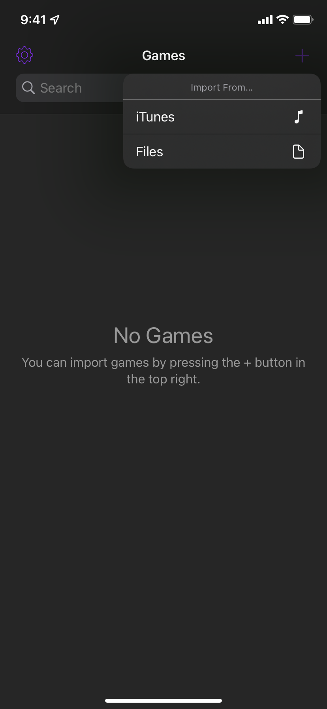

import { Icon } from "astro-icon/components";

Excerpt from the official Delta page:

> Delta needs **ROMs** in order to play games. ROMs are special files containing a game's data. There are many ways to get a game's ROM file, but we recommend using a tool like [GB Operator](https://www.epilogue.co/product/gb-operator) - though you can find other similar tools online.
>
> Once you have a ROM, you can add it to your library by tapping '+' in the top right corner of Delta's main screen. The ROM must have one of the supported file extensions below.

## Supported File Formats:

| System                                    | Accepted Formats      |
| ----------------------------------------- | --------------------- |
| NES :arcticons-snes9x:                    | .nes                  |
| SNES :arcticons-snes9x:                   | .smc, .sfc, .fig      |
| Game Boy :streamline-gameboy:             | .gb                   |
| Game Boy Color :teenyicons-gbc-outline:   | .gbc                  |
| Game Boy Advance :teenyicons-gba-outline: | .gba                  |
| Nintendo DS :simple-icons-nintendo3ds:    | .ds, .nds             |
| Nintendo 64 :file-icons-nintendo64:       | .n64, .z64            |
| Sega Genesis :simple-icons-sega:          | .gen, .bin, .md, .smd |

