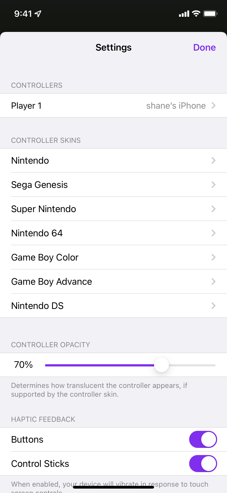

import { Icon } from "astro-icon/components";

You can access Delta's settings by tapping the icon in the top left of Delta's main screen.

## Controllers

Here you can change which controller you would like to play with and customize the button mappings for each system.

:::note
For more info on using controllers with Delta, see the [Controllers](/emu-docs/using-delta/controllers) page.
:::
