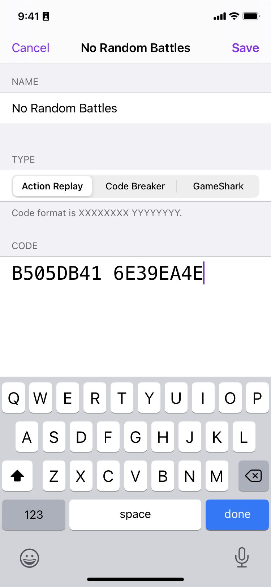
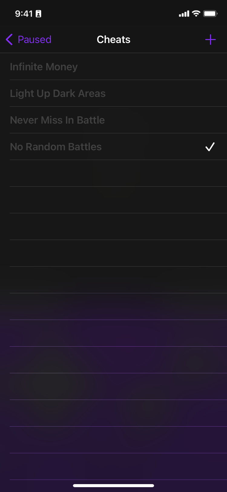

import Tooltip from '../../../components/Tooltip.vue';

Delta allows you to use cheat codes made for [Action Replay](https://en.wikipedia.org/wiki/Action_Replay) <Tooltip tooltipKey="action-replay" client:load />, [GameShark](https://en.wikipedia.org/wiki/GameShark) <Tooltip tooltipKey="gameshark" client:load />, and other cheat devices.

Simply launch the game you want to add cheats for then tap on the Cheat Codes button in the pause menu. From there, tap the '+' button to add a cheat code. When adding cheats, choose which 'cheat device' the cheat is for and then enter the name and code.

Once you add a cheat code, it will appear with a check mark to show that is enabled. To disable a cheat, tap on the cheat name.

