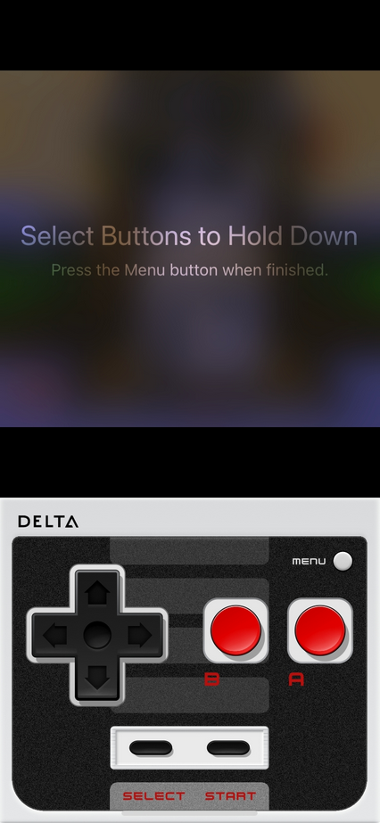

The Hold Buttons feature allows you to keep specific buttons held down so that you can have your fingers free for additional buttons. Some common examples include:

- Holding down 'A' in Mario Kart to keep on the gas

- Holding down 'B' in Super Mario Bros. to keep Mario running continuously

- Holding down 'A' in Star Fox to keep shooting lasers

You can access the Hold Button feature from the Pause Menu to choose buttons to be permanently held down.

Once in the 'Hold Button' screen, tap on the buttons you want held and then tap 'MENU'. When you return, 'Hold Button' will be highlighted, and the buttons you selected will be virtually held down.

:::note
You can still press held buttons to perform additional actions (such as launching a fireball as Mario while 'B' is held down to run).
:::

